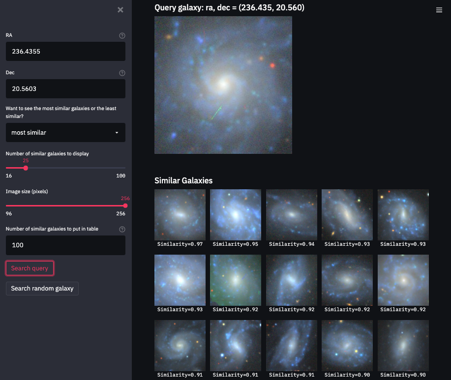

# Welcome to Galaxy Finder!

This is an interactive galaxy visualization app using the streamlit library [streamlit](https://docs.streamlit.io/en/stable/):
 
1. You enter the coordinates of your favourite galaxy, or let it select a random one.
2. It searches for the most similar looking ones in the [DECaLS dr9 dataset](https://www.legacysurvey.org/viewer).
3. It displays the images and datatables, and gives download links.
4. A variety of options can be found in the sidebar.

---
  
### A bit about the method:                                                                                             
- To do this we used a type of machine learning called "self-supervised representation learning" to boil down each image into a concentrated vector of information, or `representation', that encapsulates the appearance and properties of the galaxy.
- For each galaxy image we create new versions by rotating it, adding noise, blurring it, etc., and we teach the machine to learn the same representation for all these versions of the same galaxy. In this way, we move beyond looking at pixel values, and teach the machine a deeper understanding of the image.
- Once we have trained the machine learning model on millions of galaxies we calculate and save the representation of every image. Then, you tell us what galaxy to use as a starting point, we find the representation belonging to the image of that galaxy, compare it to millions of other representations from all the other galaxies, and return the most similar images!

**Please see [our paper](https://arxiv.org/abs/2012.13083) or [website](https://portal.nersc.gov/project/dasrepo/self-supervised-learning-sdss/) for more details on the method.**
- Products here are just initial trials - we are working hard to create better models!

What data we used:
- We used galaxy images from DECaLS dr9 https://www.legacysurvey.org/, randomly sampling 3.5 million galaxies to train the machine learning model. We can then apply it on every galaxy in the dataset, about 42 million galaxies with z-band magnitude < 20. Right now we have included only the 3.5 Million galaxies we trained it on. Most bright things in the sky should be included, with some dimmer and smaller objects missing - more to come soon!

Updates will come periodically as we add more data and train better models

Created by [George Stein](https://github.com/georgestein) 	    
